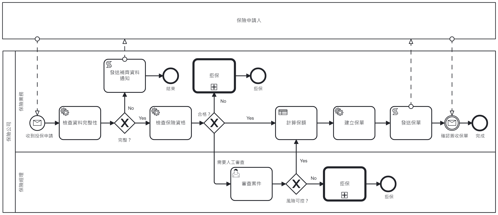

# Insurance
Camunda Spring Boot Application.

This project has been generated by the Maven archetype
[camunda-archetype-spring-boot-7.18.0](https://docs.camunda.org/manual/7.18/user-guide/).

## Show me the important parts!
[BPMN Process](src/main/resources/insurance.bpmn)



## How does it work?

## How to use it?

### Unit Test
You can run the JUnit test in your IDE or using:
```bash
mvn clean test
```

### Running the application
You can also build and run the process application with Spring Boot.

#### Manually
1. Build the application using:
```bash
mvn clean package
```
2. Run the *.jar file from the `target` directory using:
```bash
java -jar target/insurance.jar
```

#### Your Java IDE
1. Run the project as a Java application in your IDE using CamundaApplication as the main class.

2. Start process.

`curl -X POST -H "Content-Type: application/json" localhost:8080/engine-rest/message -d @request_message.json`

3. Receive contract.

`curl -X POST -H "Content-Type: application/json" localhost:8080/engine-rest/message -d @contract_message.json`

### Run and Inspect with Tasklist and Cockpit
Once you deployed the application you can run it using
[Camunda Tasklist](http://docs.camunda.org/latest/guides/user-guide/#tasklist)
and inspect it using
[Camunda Cockpit](http://docs.camunda.org/latest/guides/user-guide/#cockpit).

## Environment Restrictions
Built and tested against Camunda BPM version 7.10.0.

## Known Limitations

## License
[Apache License, Version 2.0](http://www.apache.org/licenses/LICENSE-2.0).

<!-- HTML snippet for index page
  <tr>
    <td></td>
    <td><a href="snippets/insurance">Camunda Spring Boot Application</a></td>
    <td>Spring Boot Application using [Camunda](http://docs.camunda.org).</td>
  </tr>
-->
<!-- Tweet
New @Camunda example: Camunda Spring Boot Application - Spring Boot Application using [Camunda](http://docs.camunda.org). https://github.com/camunda-consulting/code/tree/master/snippets/insurance
-->