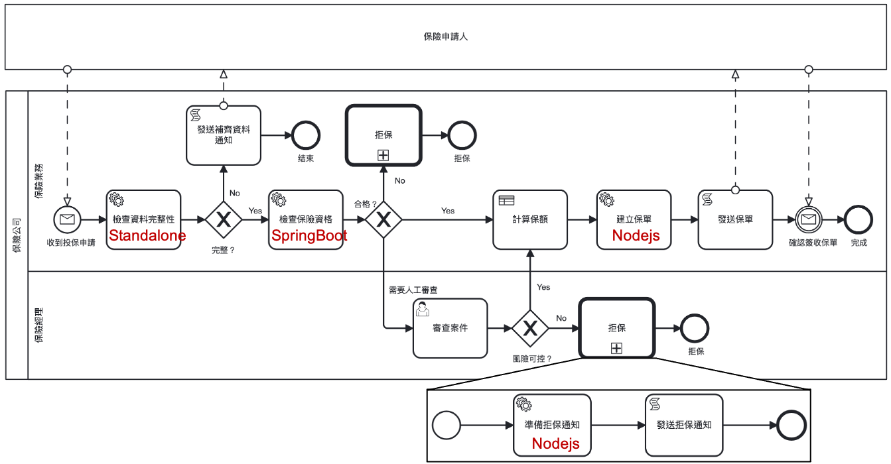

# Insurance
Camunda Platform Run and External Tasks.

## Show me the important parts!
[BPMN Process](insurance.bpmn)

## Prerequisite

1. Docker Engine
2. JDK11+
3. Nodejs v16

## Initialization

1. Run Camunda-Run `docker run -d --name camunda -p 8080:8080 camunda/camunda-bpm-platform:run-7.19.0`
2. Deploy BPMNs and DMN file by Camunda Modeler.

## Running those Applications

### Standalone Java

1. `cd standalone`
2. `mvn clean dependency:copy-dependencies package`
3. `java -jar target/insurance-1.0.0-SNAPSHOT.jar`

### Spring Boot

1. `cd springboot`
2. `mvn clean package`
3. `java -jar target/insurance-1.0.0-SNAPSHOT.jar`

### Nodejs

1. `cd nodejs`
2. `npm install`
3. `npm start` or `node index.js`

### Start Insurance Process
1. Submit insurance [request message json](request_message.json) either use Camunda Swagger UI `http://localhost:8080/swaggerui/#/Message` or curl `curl -X POST -H "Content-Type: application/json" localhost:8080/engine-rest/message -d @request_message.json`.

3. Receive contract [contract message json](contract_message.json) either use Camunda Swagger UI `http://localhost:8080/swaggerui/#/Message` or curl `curl -X POST -H "Content-Type: application/json" localhost:8080/engine-rest/message -d @contract_message.json`.

### Run and Inspect with Tasklist and Cockpit
Once you deployed the application you can run it using
[Camunda Tasklist](http://docs.camunda.org/latest/guides/user-guide/#tasklist)
and inspect it using
[Camunda Cockpit](http://docs.camunda.org/latest/guides/user-guide/#cockpit).

## Environment Restrictions
Built and tested against Camunda BPM version 7.19.0.

## Known Limitations

## License
[Apache License, Version 2.0](http://www.apache.org/licenses/LICENSE-2.0).